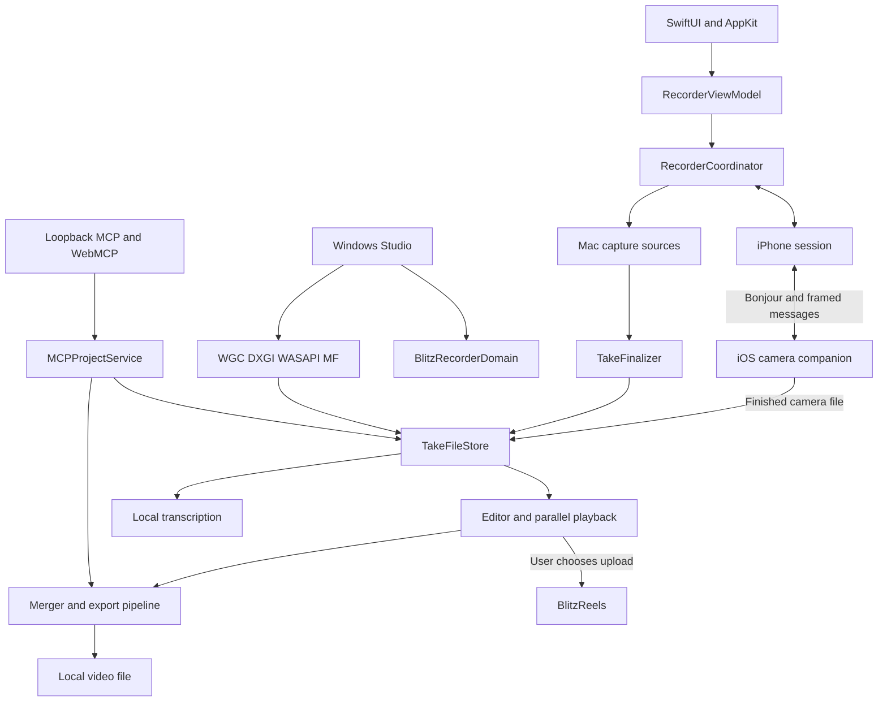

# Architecture

BlitzRecorder has a native macOS recorder and editor, a Windows Studio adapter, an iOS camera companion, and a Next.js website.
Mac and Windows write the same take folder through BlitzRecorderDomain. The companion records its camera file on the iPhone.

Start with the [README](README.md) to run the app and [CONTRIBUTING.md](CONTRIBUTING.md) for validation commands.

## How the pieces connect



The diagram shows ownership and data flow.
The website distributes downloads and handles web services independently of local capture.

## Code boundaries

- [Sources/BlitzRecorderApp](Sources/BlitzRecorderApp) contains the Mac application.
  Its `UI/` directory holds SwiftUI views, presentation state, and playback controllers.
- [Apps/iOSCamera/Sources](Apps/iOSCamera/Sources) owns companion camera capture, device controls, preview, and
  transfer.
- [BlitzRecorderCore](Packages/BlitzRecorderCore/Sources/BlitzRecorderCore) defines the shared camera protocol:
  pairing models, commands, events, capabilities, settings resolution, and transfer manifests.
- [BlitzRecorderDomain](Packages/BlitzRecorderDomain/Sources/BlitzRecorderDomain) is the platform-agnostic take,
  project, timeline time map, and scene layout. It must not import Apple media or UI frameworks.
- [Apps/WindowsStudio](Apps/WindowsStudio) is the Windows adapter: WGC screen capture (DXGI Desktop Duplication
  fallback), WASAPI loopback/mic, MF camera, D3D11 compose, NVENC/AMF/QSV/Microsoft H.264 export, parallel
  take playback, WinUI XAML Islands shell with a Win32 fallback. It depends on Domain only.
- [BlitzRecorderTransport](Packages/BlitzRecorderTransport/Sources/BlitzRecorderTransport) handles Bonjour services,
  connections, and JSON framing.
- [Web/blitzrecorder](Web/blitzrecorder) contains the Next.js site and server routes.
  Its [README](Web/blitzrecorder/README.md) describes the web directory structure.

Most recording and editor domain types still live in the Mac target.
Timeline cuts, take layout, and the portable project JSON are in Domain so Windows can write the same take folder.

## Recording lifecycle

[AppDelegate](Sources/BlitzRecorderApp/AppDelegate.swift) assembles the app services and native window integration.
[RecorderViewModel](Sources/BlitzRecorderApp/UI/RecorderViewModel.swift) connects UI actions to recording and
project state.

[RecorderCoordinator](Sources/BlitzRecorderApp/RecorderCoordinator.swift) owns source selection, permission checks,
previews, the recording session, and finalization.
[RecordingSession](Sources/BlitzRecorderApp/RecordingSession.swift) tracks the active take and state transitions.

1. Prepare the destination through `TakeFileStore`, check access and capacity, and create the take directory.
2. Resolve enabled sources and the capture mode through [TakeStartPlan](Sources/BlitzRecorderApp/TakeStartPlan.swift).
3. Start capture through [TakeRecordingRuntime](Sources/BlitzRecorderApp/TakeRecordingRuntime.swift).
   It also records scene changes and pause-aware timeline timing.
4. Stop the active writers and collect their completion results.
5. Use [TakeFinalizer](Sources/BlitzRecorderApp/TakeFinalizer.swift) to save the project, render an output,
   or report recoverable files when capture or export cannot finish.

### Capture modes

The source-file path runs the enabled recorders through
[CaptureSourceRun](Sources/BlitzRecorderApp/CaptureSourceRun.swift).
Screen and system audio use ScreenCaptureKit; local camera and microphone capture use AVFoundation.

- [ScreenRecorder](Sources/BlitzRecorderApp/ScreenRecorder.swift) writes the selected screen content.
- [CameraRecorder](Sources/BlitzRecorderApp/CameraRecorder.swift) owns local camera capture.
- [AudioRecorder](Sources/BlitzRecorderApp/AudioRecorder.swift) writes microphone audio.
- [SystemAudioRecorder](Sources/BlitzRecorderApp/SystemAudioRecorder.swift) writes Mac audio.

[LiveCompositedRecorder](Sources/BlitzRecorderApp/LiveCompositedRecorder.swift) can write the composed video during
capture.
`TakeRecordingRuntime.shouldUseLiveCompositor` selects it only when source saving and camera background post-processing
are off and no remote iPhone camera is selected.

Source saving therefore changes what can be edited later.
A recording made only as a composed video does not retain separate screen and camera images for reframing.

### Failure handling

Writer completion records whether a source produced usable media.
[TakeFinalizationPlan](Sources/BlitzRecorderApp/TakeFinalizationPlan.swift) checks the expected visible sources
before export.

Finalization can return a saved video, an editable project, or recovery files with a reason.
Keep these outcomes distinct so the UI does not report a successful export when a required source failed.

## Projects and files

[TakeFileStore](Sources/BlitzRecorderApp/TakeFileStore.swift) owns the project schema, take manifests, history index,
file operations, and security-scoped access to the chosen destination.
It writes project and manifest JSON atomically.

| Type | Meaning |
| --- | --- |
| `RecordingTake` | Paths and identity for a capture session |
| `SourceTakeManifest` | Captured files, source roles, and output information |
| `RecordingProject` | Sources, settings, scenes, timeline edits, analysis references, and export history |
| `RecordingProjectHistory` | The local index used by the Projects library |

A take can contain the following files, depending on capture settings and completed analysis:

```text
take-directory/
  take.json
  project.blitzrecorder.json
  screen.mov
  camera.mov
  audio.m4a
  system-audio.m4a
  cursor-track.json
  transcript.json
  transcript.txt
```

Video and audio extensions depend on the chosen source formats.
Disabled sources and analyses that have not run have no corresponding media or analysis file.

Saved source takes live under `BlitzRecorder Source Takes` in the configured output directory.
The Projects history index is `BlitzRecorder Projects/projects.json` under the same output directory.

Treat the project JSON as persisted user data.
Changes to the schema need decoding compatibility and project reload coverage, including missing or moved media.

## Editor, playback, and export

[EditorView](Sources/BlitzRecorderApp/UI/EditorView.swift) combines the canvas, timeline, inspector, and export
controls.
The saved edit includes scenes, cuts, text overlays, and screen zoom in addition to the original sources.

[EditorPlaybackController](Sources/BlitzRecorderApp/UI/EditorPlaybackController.swift) synchronizes the available media
on the take timeline and chooses the longest playable source as its clock.
Selecting a timeline item changes the inspector selection; playback continues to use the full parallel timeline.

[TimelineEdits](Sources/BlitzRecorderApp/TimelineEdits.swift) defines cuts, text overlays, and the edited time map.
[SilenceDetection](Sources/BlitzRecorderApp/SilenceDetection.swift) supplies candidate pauses for the editing workflow.

Scene placement is shared through [SceneLayoutGraph](Sources/BlitzRecorderApp/SceneLayoutGraph.swift),
[SceneRenderGeometry](Sources/BlitzRecorderApp/SceneRenderGeometry.swift), and
[RecordingSceneTimeline](Sources/BlitzRecorderApp/RecordingSceneTimeline.swift).
Preview and export need to agree on crops, layer order, source timing, and scene transitions.

[Merger](Sources/BlitzRecorderApp/Merger.swift) builds the media composition and audio mix.
[FinalExportPlan](Sources/BlitzRecorderApp/FinalExportPlan.swift) resolves source insertion, timing, and render
segments.

The render path uses [MetalExportVideoCompositor](Sources/BlitzRecorderApp/MetalExportVideoCompositor.swift).
Output goes through `AVAssetExportSession` or
[OptimizedCompositionExporter](Sources/BlitzRecorderApp/OptimizedCompositionExporter.swift),
which uses an AVAssetReader/AVAssetWriter pipeline and hardware encoding when supported.

Export settings apply to the rendered video.
Editing and re-exporting a source-backed project leave its recorded source media unchanged.

## iPhone camera and transfer

The Mac coordinates the take; the iPhone owns camera capture and its full-quality recording.
Live monitor frames are a separate preview stream and do not become the final camera file.

- [RemoteIPhoneCameraSession](Sources/BlitzRecorderApp/RemoteIPhoneCameraSession.swift) connects the Mac coordinator
  to discovery, pairing, camera commands, preview, and import.
- [CameraCompanionStore](Apps/iOSCamera/Sources/CameraCompanionStore.swift) connects the iOS UI to the companion
  runtime.
- [CameraCaptureController](Apps/iOSCamera/Sources/CameraCaptureController.swift) manages the iPhone capture session.
- [RemoteCameraTransferManager](Sources/BlitzRecorderApp/RemoteCameraTransferManager.swift) receives media on the Mac.
- [CameraCompanionTransferSender](Apps/iOSCamera/Sources/CameraCompanionTransferSender.swift) sends the saved phone
  file.

Bonjour discovers the companion on the local network, and the pairing flow uses a six-digit code.
The shared protocol carries commands, camera capabilities, preview data, and transfer messages.

Transfers use manifests, chunk offsets, acknowledgments, and byte-count checks, with checksum validation when provided.
Partial files and pending-import records allow an interrupted transfer to resume.

The camera's timing metadata aligns imported footage with the Mac take timeline.
Keep transfer completion separate from recording completion: the camera file can still be arriving after capture stops.

## Transcription and integrations

### Local transcription

[LocalTranscriptionController](Sources/BlitzRecorderApp/LocalTranscriptionController.swift) queues work and reports
progress.
[LocalTranscriptionEngine](Sources/BlitzRecorderApp/LocalTranscriptionEngine.swift) is an actor that runs FluidAudio
speech recognition and speaker diarization.

Models download separately and are stored in Application Support.
[TranscriptionAudioPreparer](Sources/BlitzRecorderApp/TranscriptionAudioPreparer.swift) prepares audio for the engine,
and [RecordingTranscript](Sources/BlitzRecorderApp/RecordingTranscript.swift) defines transcript data and artifact
storage.

Transcription runs locally after the models are available.
Model downloads require network access.

### MCP and WebMCP

[BlitzRecorderMCPServer](Sources/BlitzRecorderApp/BlitzRecorderMCPServer.swift) registers tools with the Swift MCP SDK.
[LoopbackMCPHTTPServer](Sources/BlitzRecorderApp/LoopbackMCPHTTPServer.swift) serves them over SwiftNIO at
`127.0.0.1:18473` while the app is open and the server is enabled.

[MCPProjectService](Sources/BlitzRecorderApp/MCPProjectService.swift) reads projects and transcripts and queues exports
through the same native export pipeline.
MCP exports run sequentially and use saved editor state; destination overrides stay within the configured export folder.

`/mcp` is the Streamable HTTP endpoint.
`/webmcp` serves the bundled browser workspace with the same project tools.

### BlitzReels handoff

[BlitzReelsHandoff](Sources/BlitzRecorderApp/BlitzReelsHandoff.swift) handles account authorization and uploads
when the user chooses to send a recording.
It stores the API key in macOS Keychain and opens the uploaded asset in BlitzReels.

This is a cloud upload, separate from local capture, transcription, and export.
The handoff uses the connected BlitzReels account and its plan access.

## Build and distribution

[Package.swift](Package.swift) defines the macOS executable, dependencies, resources, and tests.
[project.yml](project.yml) defines the XcodeGen macOS and iOS targets.

Both apps require current Apple SDKs to build, with deployment targets of macOS 15 and iOS 18.
Keep source, resource, and dependency changes consistent across SwiftPM and XcodeGen when they affect both build paths.

`DIRECT_DISTRIBUTION=1` adds Sparkle to the Mac build.
[AppUpdateController](Sources/BlitzRecorderApp/AppUpdateController.swift) manages update checks for configured
direct builds.

[AccessController](Sources/BlitzRecorderApp/AccessController.swift) currently enables all app features without a
license key.
The source license and separate commercial source agreements are described in [LICENSE](LICENSE)
and [COMMERCIAL-LICENSE.md](COMMERCIAL-LICENSE.md).

[Scripts/package-app.sh](Scripts/package-app.sh) builds and bundles the Mac app.
Tagged releases use `vX.Y.Z` and publish a universal DMG, `SHA256SUMS`, `release-metadata.json`, and a Sparkle
`appcast.xml`.
The DMG Finder window is a [Dmgly](https://dmgly.com/) native export (`Resources/dmg/dmgly.json`).

[GitHub Releases](https://github.com/blitzreels/blitzrecorder/releases) is the public changelog and download history.
A released binary corresponds to its tag, while this guide describes the source tree it accompanies.

## Where to validate a change

- Capture lifecycle and recovery: root Swift tests and `Scripts/run-resilience.py`.
- Protocol models: `Packages/BlitzRecorderCore/Tests`.
- Framing and transport: `Packages/BlitzRecorderTransport/Tests`.
- Editor and rendering: root playback, timeline, geometry, and export tests, plus a real project in the Dev app.
- Shared Mac controls: `Scripts/check-design-system.sh` and the visible app surface.
- Public repository and distribution: `Scripts/check-repo-hygiene.sh` and
  `Scripts/check-github-release-readiness.sh --local-only`.

The [contribution guide](CONTRIBUTING.md) has the commands and the limits of synthetic capture tests.
Camera quality, device disconnection, permissions, and sleep/wake behavior need physical-device validation.
