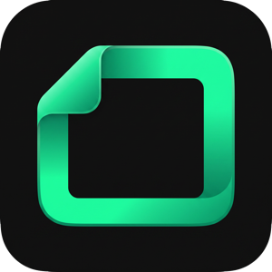
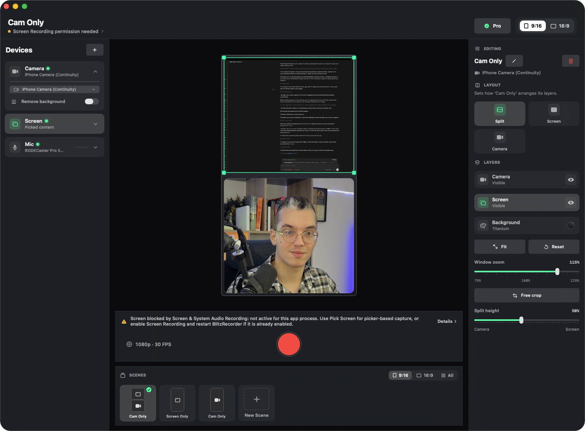

<p align="center">
  
</p>

<h1 align="center">BlitzRecorder</h1>

<p align="center">
  A native Mac recording studio with an iPhone camera companion. By <a href="https://blitzreels.com?utm_source=github&utm_medium=readme&utm_campaign=blitzrecorder-oss&utm_content=header-byline">BlitzReels</a>.<br>
  Record your screen and a studio-quality camera in one take.
</p>

<p align="center">
  <a href="https://blitzrecorder.com?utm_source=github&utm_medium=readme&utm_campaign=blitzrecorder-oss&utm_content=nav-website">Website</a>
  ·
  <a href="https://blitzrecorder.com/macos?utm_source=github&utm_medium=readme&utm_campaign=blitzrecorder-oss&utm_content=nav-download-mac">Download for Mac</a>
  ·
  <a href="https://blitzrecorder.com/ios?utm_source=github&utm_medium=readme&utm_campaign=blitzrecorder-oss&utm_content=nav-ios">iPhone Camera app</a>
  ·
  <a href="https://blitzreels.com?utm_source=github&utm_medium=readme&utm_campaign=blitzrecorder-oss&utm_content=nav-blitzreels">BlitzReels</a>
</p>

<p align="center">
  
  
  
</p>



BlitzRecorder is an open source recording studio for the Mac. It records your screen, camera, microphone, and Mac system audio into clean local files. Pair an iPhone and it becomes a remote studio camera, with live preview on the Mac, real camera controls, and automatic transfer of the finished take.

Use it for product demos, tutorials, walkthroughs, talking-head videos, and short vertical clips. You frame the shot before you press record, so the take comes out ready to publish.

## Why BlitzRecorder

- **You start recording in seconds.** Your camera, your screen, and the record button all sit in one window, so you don't dig through tabs and menus to get going.
- **You look good on camera without buying one.** Your iPhone shoots better video than any webcam. Connect it once with a 6-digit code, then aim it and set the focus and light right from your Mac.
- **Bad Wi-Fi won't wreck your video.** Your iPhone saves the video at full quality on the phone, then sends it to your Mac when you stop. A weak signal can't turn your take into a blurry mess.
- **Your video comes out ready to post.** You pick a tall or wide shape and place your screen and camera before you record. What you see is what you get, so there is nothing to fix later.
- **You won't lose a recording.** BlitzRecorder keeps your raw files, so one failed save doesn't wipe out your work. You can reopen, rename, move, or redo any take later.
- **It's light and fast on your Mac.** BlitzRecorder is built just for Mac, so it feels quick and doesn't slow your computer down while you record.

## The iPhone companion

Pair once, record on the phone at full quality, and the take lands on your Mac by itself. While the iPhone records, the Mac stays in charge. Compose the shot, switch sources, and watch the live preview in the studio without touching the phone.

## The two apps

| App | Platform | Purpose |
| --- | --- | --- |
| BlitzRecorder | macOS | The studio. Layout canvas, source capture, export, and recovery workspace. |
| BlitzRecorder Camera | iOS | The companion camera. Pairs with the Mac, records locally, and transfers the camera file back to the take. |

## Get started

1. Download BlitzRecorder for macOS from [blitzrecorder.com](https://blitzrecorder.com?utm_source=github&utm_medium=readme&utm_campaign=blitzrecorder-oss&utm_content=getstarted-website). The free version records and exports 1080p.
2. Get the iPhone companion from [blitzrecorder.com/ios](https://blitzrecorder.com/ios?utm_source=github&utm_medium=readme&utm_campaign=blitzrecorder-oss&utm_content=getstarted-ios).
3. The [Early Lifetime License](https://blitzrecorder.com/license?utm_source=github&utm_medium=readme&utm_campaign=blitzrecorder-oss&utm_content=getstarted-license) unlocks iPhone camera recording, 4K export, and 60 fps export in the official signed build.

## Local development

Requirements:

- macOS
- Xcode
- Swift Package Manager
- XcodeGen when regenerating the Xcode project
- Node.js for the website

Generate the Xcode project:

```bash
Scripts/generate-xcode-project.sh
```

Build and run the Mac app:

```bash
xcodebuild -project BlitzRecorder.xcodeproj -scheme BlitzRecorder -configuration Debug -destination 'platform=macOS' build
open build/DerivedData/Build/Products/Debug/BlitzRecorder.app
```

Run Swift checks:

```bash
swift test
swift test --package-path Packages/BlitzRecorderCore
swift test --package-path Packages/BlitzRecorderTransport
```

Build the website:

```bash
cd Web/blitzrecorder
npm install
npm run build
```

## Repository

```txt
Apps/iOSCamera/                   iPhone companion app
Packages/BlitzRecorderCore/       Shared recording and camera logic
Packages/BlitzRecorderTransport/  Pairing and transport layer
Sources/BlitzRecorderApp/         macOS app source
Tests/                            macOS app tests
Web/blitzrecorder/                Website
```

## Contributing

Issues and pull requests are welcome. Please read [CONTRIBUTING.md](CONTRIBUTING.md) before opening larger changes.

Security reports should be sent by email. See [SECURITY.md](SECURITY.md).

Release notes are tracked in [CHANGELOG.md](CHANGELOG.md) and GitHub Releases.

## License

BlitzRecorder uses a dual-license model:

- Open source under the GNU Affero General Public License v3.0 only. See [LICENSE](LICENSE).
- The direct-download Early Lifetime License unlocks paid app features in the official signed build.
- Commercial licenses are available for organizations that need non-AGPL terms. See [COMMERCIAL-LICENSE.md](COMMERCIAL-LICENSE.md).

---

<p align="center">
  <a href="https://blitzreels.com?utm_source=github&utm_medium=readme&utm_campaign=blitzrecorder-oss&utm_content=footer-logo">
    <picture>
      <source media="(prefers-color-scheme: dark)" srcset=".github/assets/readme/blitzreels-logo-white.png">
      
    </picture>
  </a>
</p>

<p align="center">
  <sub><b>BlitzRecorder</b> is made by <b>BlitzReels</b>, which helps creators record, edit, and publish video with AI.</sub>
</p>
