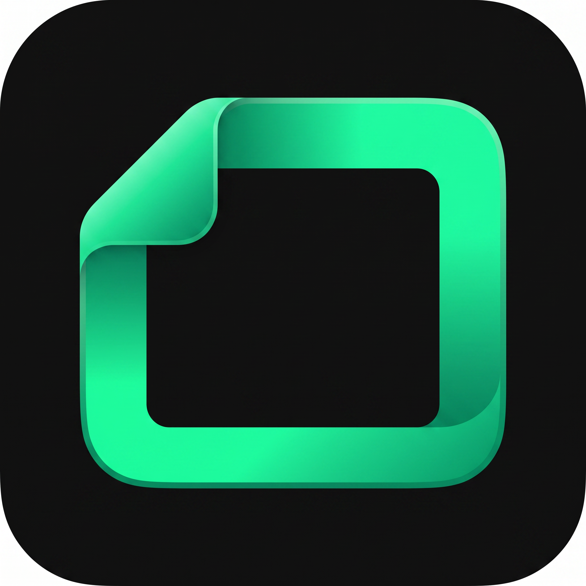
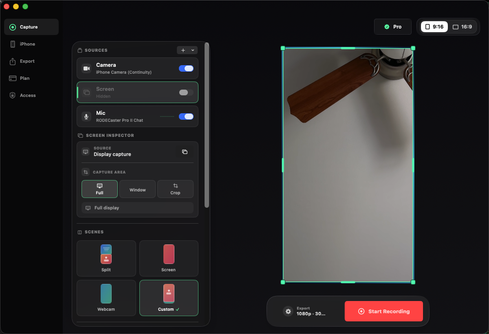
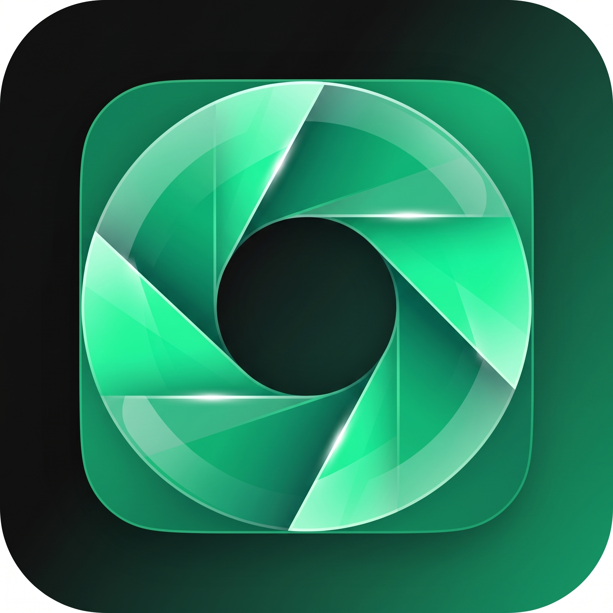
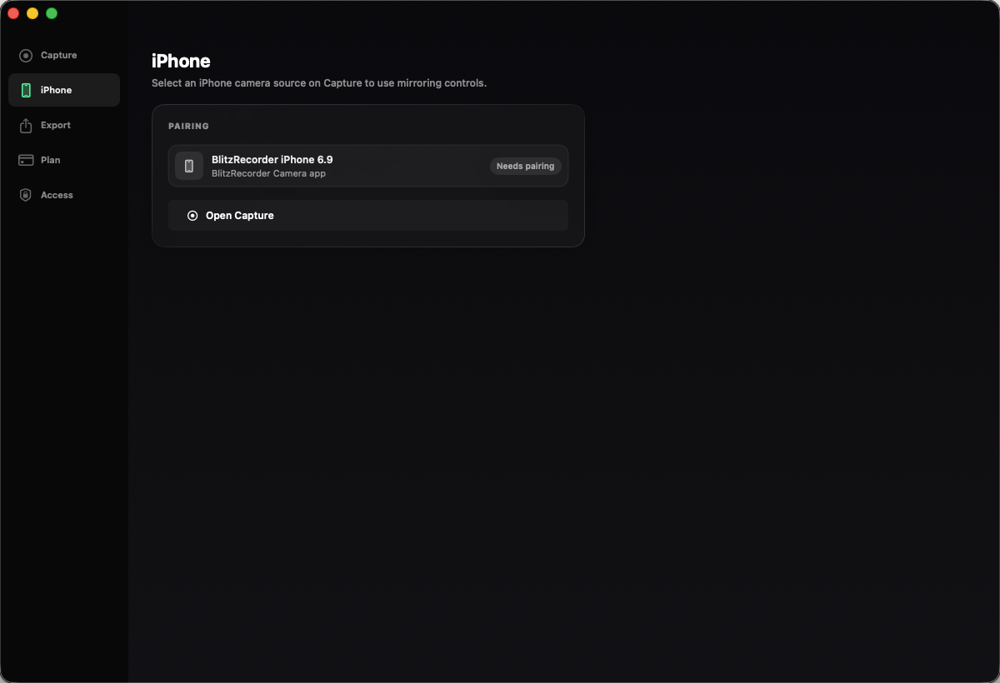
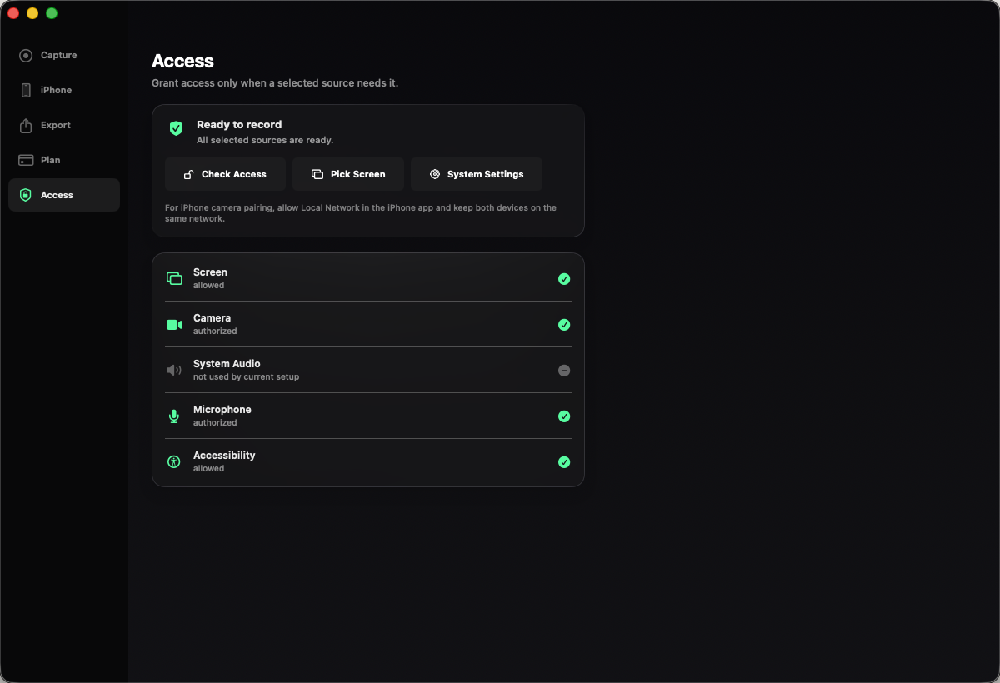
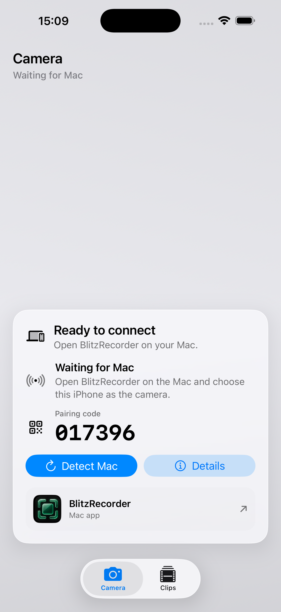

  

<h1 align="center">BlitzRecorder</h1>

  A native Mac recording studio with a companion iPhone camera app.

  <a href="docs/features.md">Features</a>
  ·
  <a href="docs/usage.md">Workflow</a>
  ·
  <a href="docs/permissions.md">Permissions</a>
  ·
  <a href="docs/README.md">Docs</a>

  

BlitzRecorder is a screen recording studio for product demos, tutorials, walkthroughs, creator updates, and short-form videos. It combines a native Mac recording canvas with optional iPhone camera capture so each take is framed before recording and recoverable after capture.

## Brand Kit

| macOS app | iOS companion |
| --- | --- |
|  |  |
| **BlitzRecorder** | **BlitzRecorder Camera** |

The current identity uses the folded-capture mark for macOS and the folded-lens mark for iOS. The system keeps the BlitzReels energy but moves the app icons closer to native Apple platform styling: dimensional glass, crisp depth, rounded-square silhouettes, and camera/recording symbolism.

| Token | Value | Use |
| --- | --- | --- |
| Signal green | `#31F6A2` | Primary recording and connection moments. |
| Deep ink | `#08110F` | App and marketing backgrounds. |
| Soft mint | `#DDFCF0` | High-contrast copy on dark UI. |
| Mist grey | `#8FA69C` | Secondary copy and interface labels. |

## Why BlitzRecorder

- **Record the full take.** Capture screen, camera, microphone, and Mac audio together.
- **Frame before recording.** Build vertical or horizontal creator layouts on the live canvas.
- **Use your iPhone.** Pair BlitzRecorder Camera as a controllable remote camera source.
- **Keep takes recoverable.** Reveal source files and retry exports when a recording needs recovery.
- **Finish faster.** Open, reveal, rename, or start a new take from the post-recording state.

## Screenshots

| Recording Canvas | iPhone Camera Controls |
| --- | --- |
|  |  |

| Recording Plan | iOS Companion Camera |
| --- | --- |
|  |  |

## Apps

| App | Role |
| --- | --- |
| **BlitzRecorder for macOS** | Main recording, layout, source capture, export, and recovery workspace. |
| **BlitzRecorder Camera for iPhone** | Companion camera that pairs with the Mac, records locally, and transfers the camera file back to the take. |

## Website

- Production site: [blitzrecorder.com](https://blitzrecorder.com)
- Vercel fallback: [blitzrecorder.vercel.app](https://blitzrecorder.vercel.app)
- Vercel project: `varkoffs-projects/blitzrecorder`
- Source: [Web/blitzrecorder](Web/blitzrecorder)

The website is a static Vite/React build. There is no SSR runtime and no account system.
Vercel rewrites the clean routes (`/terms`, `/privacy`, `/support`, `/ios`, `/macos`,
and `/brand-guidelines`) to the single React entrypoint.

## Product References

BlitzRecorder is currently closed-source and commercial. The product direction takes inspiration
from open-source screen recording tools without implying affiliation or code reuse:

| Project | What is useful to study |
| --- | --- |
| [Cap](https://cap.so/) | Native-feeling recording, ownership-first positioning, and open-source transparency. |
| [Recordly](https://github.com/webadderall/Recordly) | Polished recording-to-editing workflow for demos, tutorials, product videos, cursor polish, and zoom effects. |
| [OpenScreen](https://github.com/RockySteveJobs/openscreen) | Free Screen Studio-style workflow: screen/window recording, automatic zooms, annotations, backgrounds, trimming, and multi-aspect export. |

Reference projects should inform product taste, onboarding clarity, and workflow expectations.
Any implementation borrowing must be reviewed separately for licensing and attribution before use.

## Documentation

- [Feature overview](docs/features.md)
- [User workflow](docs/usage.md)
- [Permissions](docs/permissions.md)
- [Development](docs/development.md)
- [Architecture](docs/architecture.md)
- [Release](docs/release.md)
