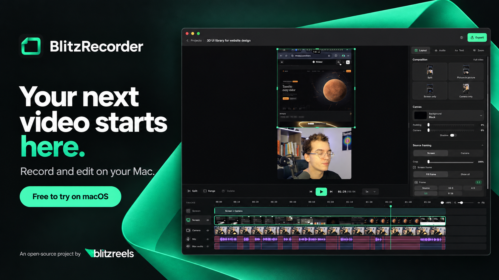
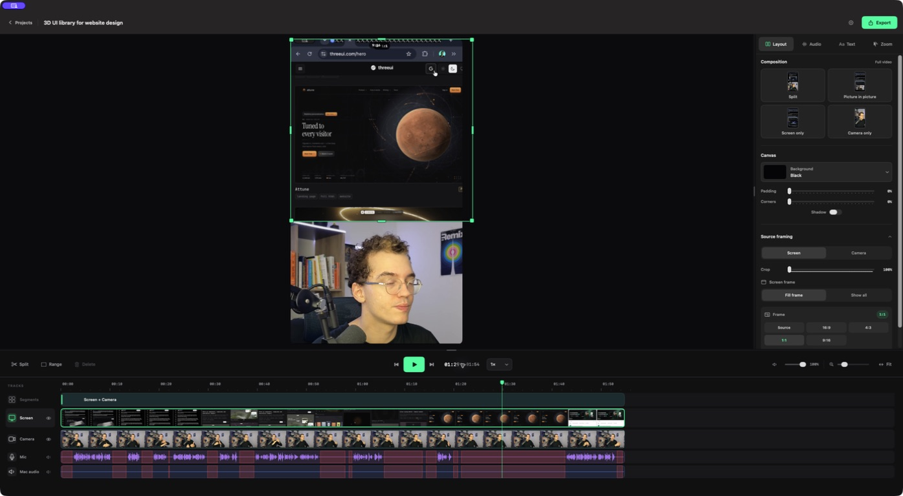

<h1 align="center">BlitzRecorder</h1>



<p align="center">
  Record your screen and camera, then edit the take.<br>
  An open-source recorder: macOS studio plus a Windows capture app, built by <a href="https://blitzreels.com">BlitzReels</a>.<br>
  Free on macOS 15 or later. No account or app license key.
</p>

<p align="center">
  <a href="https://blitzrecorder.com/macos">Download for macOS</a>
  · <a href="https://github.com/blitzreels/blitzrecorder/releases">Download for Windows</a>
  · <a href="https://blitzrecorder.com/ios">iPhone companion</a>
  · <a href="ARCHITECTURE.md">Architecture</a>
  · <a href="CONTRIBUTING.md">Contribute</a>
  · <a href="https://github.com/blitzreels/blitzrecorder/releases">Release notes</a>
</p>

<p align="center">
  
  
  <a href="LICENSE">
    
  </a>
</p>

BlitzRecorder is for product demos, tutorials, walkthroughs, and videos where you need both your screen and your face.
Choose your sources, arrange the frame, and record on your Mac.

Open the take in the editor to cut pauses, change layouts, add text, and export a finished video.
Your recordings stay on your devices unless you choose to share them.

## What you can do

- Record a screen, window, or app alongside a camera, microphone, and Mac system audio.
- Compose vertical or horizontal video, adjust crops and backgrounds, and switch scenes during a take.
- Use your iPhone as a remote camera, with live preview and camera controls on the Mac.
- Edit synchronized screen, camera, and audio tracks with waveforms, silence detection, text overlays, and zoom.
- Generate transcripts and identify speakers on your Mac after downloading the transcription models.
- Save separate source files so you can revisit the edit, and export video with resolution and frame rate controls.
- Browse recordings in Projects, rename takes, copy transcripts, and open the files in Finder.
- Connect an agent through the local MCP server to inspect projects and queue exports.

The current app source enables iPhone recording, 4K export, and 60 fps export without an account or app license key.
Available capture settings still depend on your camera and hardware.



An actual capture of the rebuilt editor, with screen, camera, microphone, and system audio on the same timeline.

## Try it on your Mac

1. [Download BlitzRecorder for macOS][download], open the DMG, and drag the app into Applications.
2. Open BlitzRecorder and grant the permissions for the sources you want to record.
   macOS can ask you to quit and reopen the app after granting screen recording access.
3. Choose your screen, camera, and audio sources, set the frame, and press Record.
4. Stop recording, open the take in Projects, and edit or export it.

The Mac app supports Apple silicon and Intel Macs running macOS 15 or later.
The optional camera companion requires iOS 18 or later.

### Try it on Windows

Install the signed `BlitzRecorder-Windows.exe` from [GitHub Releases][releases] (tagged `v*` builds; no zip). Per-user, no admin (`%LOCALAPPDATA%\Programs\BlitzRecorder`).
Allow Screen recording and Microphone when Windows asks, pick the display if you have more than one, press **Start**, then **Stop**. **Open take** plays screen + mic (+ camera/system audio) from a folder — including after restart.
**Open last take** plays screen + mic in parallel.

Windows Studio records and plays a take. It does not clone Continuity Camera, Liquid Glass, or the Mac editor.

This README describes the current source tree.
For the features included in a downloaded build, see its [release notes][releases].

### Use your iPhone as the camera

Install [BlitzRecorder Camera][iphone], put both devices on the same local network, and pair with the six-digit code.
You can frame the shot and adjust supported camera settings from the Mac.

The iPhone records the full-quality camera file on the phone while sending a separate live preview to the Mac.
When you stop, it transfers the finished file into the take; interrupted transfers can resume.

### Turn the recording into clips with BlitzReels

BlitzRecorder is a [BlitzReels][blitzreels] project.
We build tools that help creators spend more time making videos and less time preparing them for each platform.

Record and edit here, then choose **Send to BlitzReels** in the editor to upload a source or a finished export.
BlitzReels can find moments in longer recordings, reframe them for vertical video, and add captions and branding.

The upload is optional and uses your BlitzReels account and plan.
You can record, edit, and export locally without connecting it.

## Build from source

Use a Mac with Xcode 26 or later and its command line tools selected.
The Mac development script uses Swift Package Manager; XcodeGen is needed only to regenerate the Xcode project.

```bash
git clone https://github.com/blitzreels/blitzrecorder.git
cd blitzrecorder
./script/build_and_run.sh run
```

This builds, installs, and opens `/Applications/BlitzRecorder Dev.app` with bundle ID
`dev.blitzreels.blitzrecorder.debug`.
Grant this development app its own capture permissions when macOS asks.

For a build and launch check that closes the app afterward:

```bash
./script/build_and_run.sh --verify
```

Stop any active Dev recording before running these commands, since the script restarts the Dev app.
The verification mode disables idle capture; checking camera, microphone, and screen behavior needs a real recording.

To work on the iPhone companion, generate and open the Xcode project:

```bash
Scripts/generate-xcode-project.sh
open BlitzRecorder.xcodeproj
```

Select the `BlitzRecorderCamera` scheme and your own signing team for a physical device build.

### Checks

```bash
swift test
swift test --package-path Packages/BlitzRecorderCore
swift test --package-path Packages/BlitzRecorderDomain
swift test --package-path Packages/BlitzRecorderTransport
swift build --package-path Apps/WindowsStudio
Scripts/check-repo-hygiene.sh
```

See [CONTRIBUTING.md](CONTRIBUTING.md) for capture validation, resilience tests, and website development.
The [architecture guide](ARCHITECTURE.md) maps the recording lifecycle, project format, and source files.

## Local agent tools

With the Mac app open, go to **Settings > Integrations** to enable the local server, test the connection,
and copy client setup details.
It exposes Streamable HTTP MCP at `http://127.0.0.1:18473/mcp`.

For Codex, run:

```bash
codex mcp add blitzrecorder --url http://127.0.0.1:18473/mcp
```

Start a new Codex task after adding the server so it discovers the tools.
Agent Plugin 1.0-compatible clients can use the `mcp.json` entry shown in Settings.

The tools can filter projects, check source readiness, read saved transcripts, inspect previous exports,
and queue one or more MP4 exports.
Exports use the saved editor state and export recipe, run sequentially, and expose job progress.

`projects_export_as_is` accepts an optional absolute `outputDirectory`.
It defaults to the configured export folder; an override must be that folder or one of its subfolders.

For browser clients, choose **Open workspace** in the same Settings page.
The WebMCP workspace at `http://127.0.0.1:18473/webmcp` exposes the same tools in a compatible browser.

The server listens only on your Mac's loopback address.
Connecting a client gives that client access to the project information and transcripts it requests.

## Repository map

| Path | What lives there |
| --- | --- |
| [Sources/BlitzRecorderApp](Sources/BlitzRecorderApp) | Mac UI, capture, editing, exports, transcription, and MCP |
| [Apps/iOSCamera](Apps/iOSCamera) | iPhone camera app, preview, recording, and transfer |
| [Packages/BlitzRecorderCore](Packages/BlitzRecorderCore) | Shared camera messages, capabilities, and transfer models |
| [Packages/BlitzRecorderDomain](Packages/BlitzRecorderDomain) | Portable take/timeline math (no Apple frameworks) |
| [Apps/WindowsStudio](Apps/WindowsStudio) | Windows WGC/DXGI capture, D3D11 compose, WinUI shell |
| [Packages/BlitzRecorderTransport](Packages/BlitzRecorderTransport) | Bonjour discovery and framed JSON connections |
| [Tests](Tests) | Mac app tests |
| [Web/blitzrecorder](Web/blitzrecorder) | Next.js website and download services |
| [Scripts](Scripts) | Validation, packaging, and release scripts |

## Contribute

Bug reports, focused fixes, and documentation improvements are welcome.
Read [CONTRIBUTING.md](CONTRIBUTING.md), and open an issue before starting a larger change.

Use [GitHub Issues][issues] for reproducible bugs and feature requests.
Send sensitive security reports through the contact in [SECURITY.md](SECURITY.md).

Campaign artwork and the editor screenshot are in the [marketing assets](.github/assets/readme/marketing/README.md).

## License

The source is available under the [GNU Affero General Public License v3.0 only](LICENSE).
Separate [commercial source licenses](COMMERCIAL-LICENSE.md) are available from the copyright holder.

<p align="center">
  <a href="https://blitzreels.com">
    <picture>
      <source media="(prefers-color-scheme: dark)" srcset=".github/assets/readme/blitzreels-logo-white.png">
      
    </picture>
  </a>
</p>

[download]: https://blitzrecorder.com/macos
[iphone]: https://blitzrecorder.com/ios
[blitzreels]: https://blitzreels.com?utm_source=github&utm_medium=readme&utm_campaign=blitzrecorder-oss
[releases]: https://github.com/blitzreels/blitzrecorder/releases
[issues]: https://github.com/blitzreels/blitzrecorder/issues
