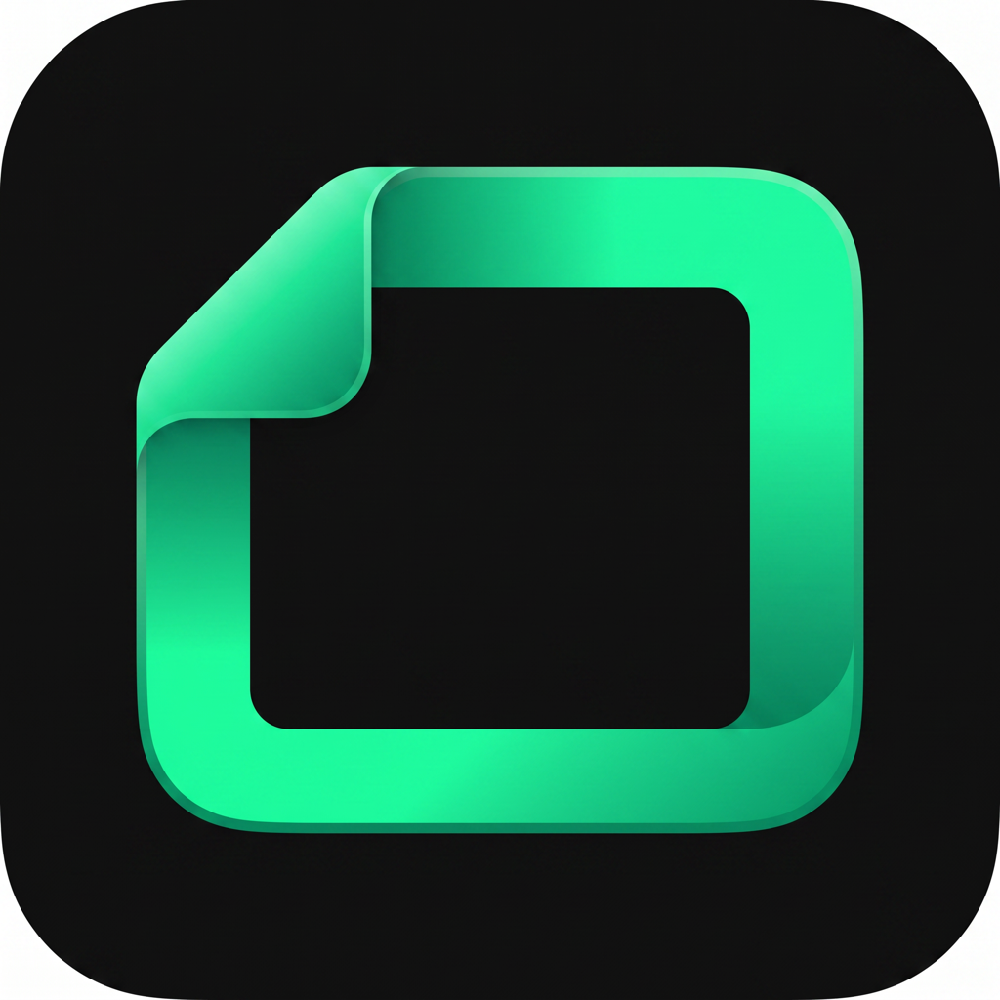
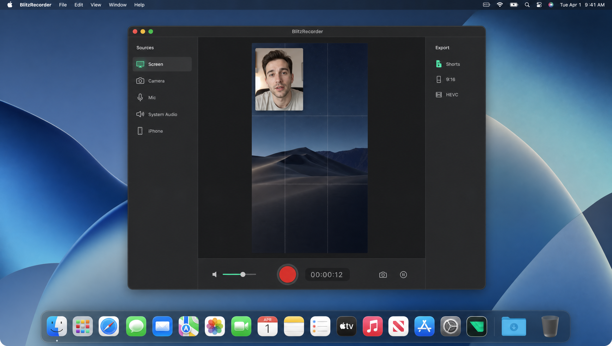
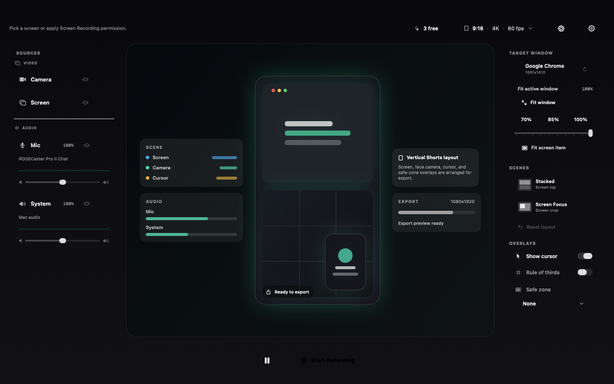
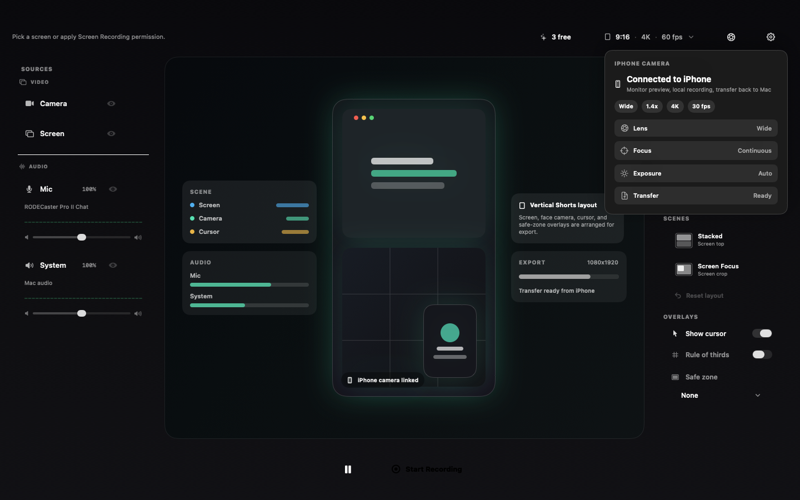
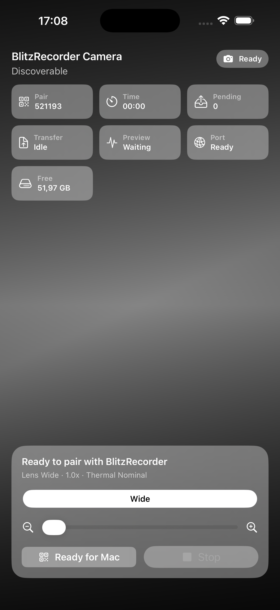
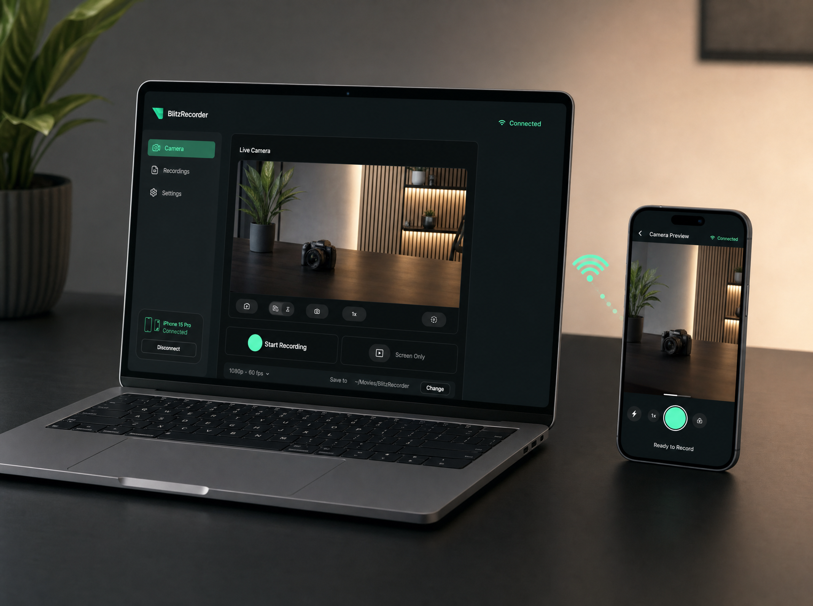

  

<h1 align="center">BlitzRecorder</h1>

  Record polished creator videos from your Mac, camera, microphone, system audio, and iPhone.

  <a href="docs/features.md">Features</a>
  ·
  <a href="docs/usage.md">Workflow</a>
  ·
  <a href="docs/permissions.md">Permissions</a>
  ·
  <a href="docs/README.md">Docs</a>

  

BlitzRecorder is a screen recording studio for product demos, tutorials, walkthroughs, creator updates, and short-form videos. It combines a Mac recording canvas with optional iPhone camera capture so each take is already framed for export.

## Why BlitzRecorder

- **Record the full take.** Capture screen, camera, microphone, and Mac audio together.
- **Frame before recording.** Build vertical or horizontal creator layouts on the live canvas.
- **Use your iPhone.** Pair BlitzRecorder Camera as a controllable remote camera source.
- **Keep takes recoverable.** Reveal source files and retry exports when a recording needs recovery.
- **Finish faster.** Open, reveal, rename, or start a new take from the post-recording state.

## Screenshots

| Recording Canvas | iPhone Camera Controls |
| --- | --- |
|  |  |

| iPhone Pairing | Companion Setup |
| --- | --- |
|  |  |

## Apps

| App | Role |
| --- | --- |
| **BlitzRecorder for macOS** | Main recording, layout, export, and recovery workspace. |
| **BlitzRecorder Camera for iPhone** | Companion camera that pairs with the Mac, records locally, and transfers the camera file back to the take. |

## Documentation

- [Feature overview](docs/features.md)
- [User workflow](docs/usage.md)
- [Permissions](docs/permissions.md)
- [Development](docs/development.md)
- [Architecture](docs/architecture.md)
- [Release](docs/release.md)
